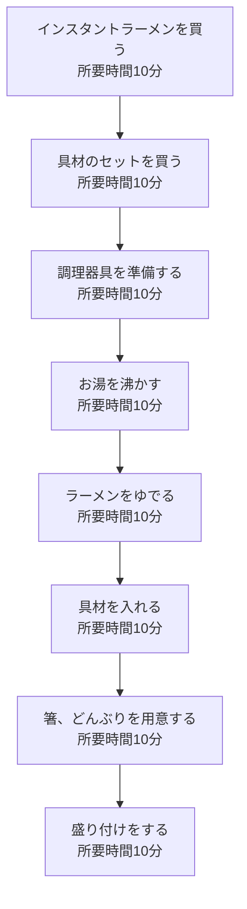

```mermaid

flowchart TD

id1["インスタントラーメンを買う
所要時間10分"]

id2["具材のセットを買う
所要時間10分"]

id3["調理器具を準備する
所要時間10分"];

id4["お湯を沸かす
所要時間10分"]

id5["ラーメンをゆでる
所要時間10分"]

id6["具材を入れる
所要時間10分"]

id7["箸、どんぶりを用意する
所要時間10分"]

id8["盛り付けをする
所要時間10分"]

id1-->id2;
id2-->id3;
id3-->id4;
id4-->id5;
id5-->id6;
id6-->id7;
id7-->id8;
```