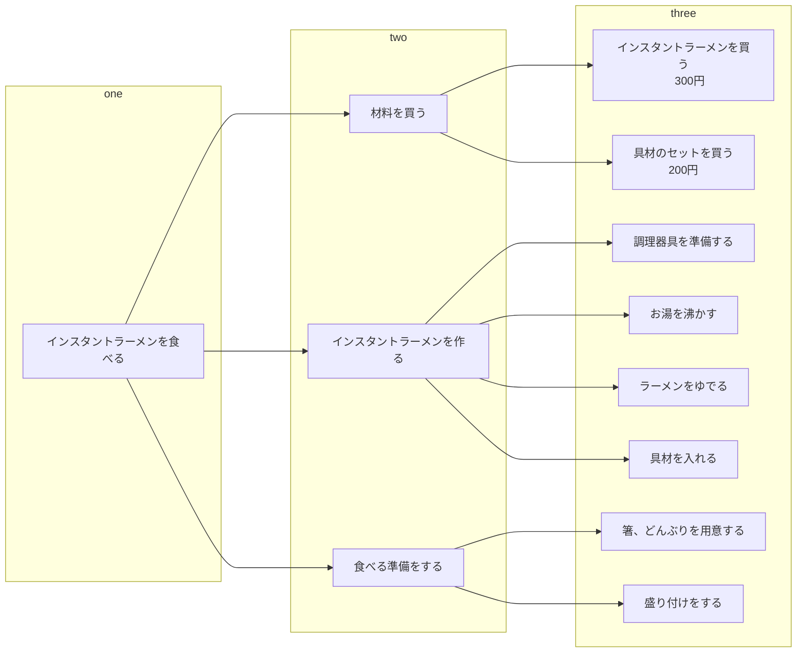

```mermaid

flowchart LR

subgraph "one"
    id1["インスタントラーメンを食べる"]
end

subgraph "two"
    id2["材料を買う"]
    id3["インスタントラーメンを作る"]
    id4["食べる準備をする"]
end

subgraph "three"
    id5["インスタントラーメンを買う
    300円"]
    id6["具材のセットを買う
    200円"]
    id7["調理器具を準備する"];
    id8["お湯を沸かす"]
    id9["ラーメンをゆでる"]
    id10["具材を入れる"]
    id11["箸、どんぶりを用意する"]
    id12["盛り付けをする"]
end

id1--->id2;
id1--->id3;
id1--->id4;

id2--->id5;
id2--->id6;
id3--->id7;
id3--->id8;
id3--->id9;
id3--->id10;
id4--->id11;
id4--->id12;
```