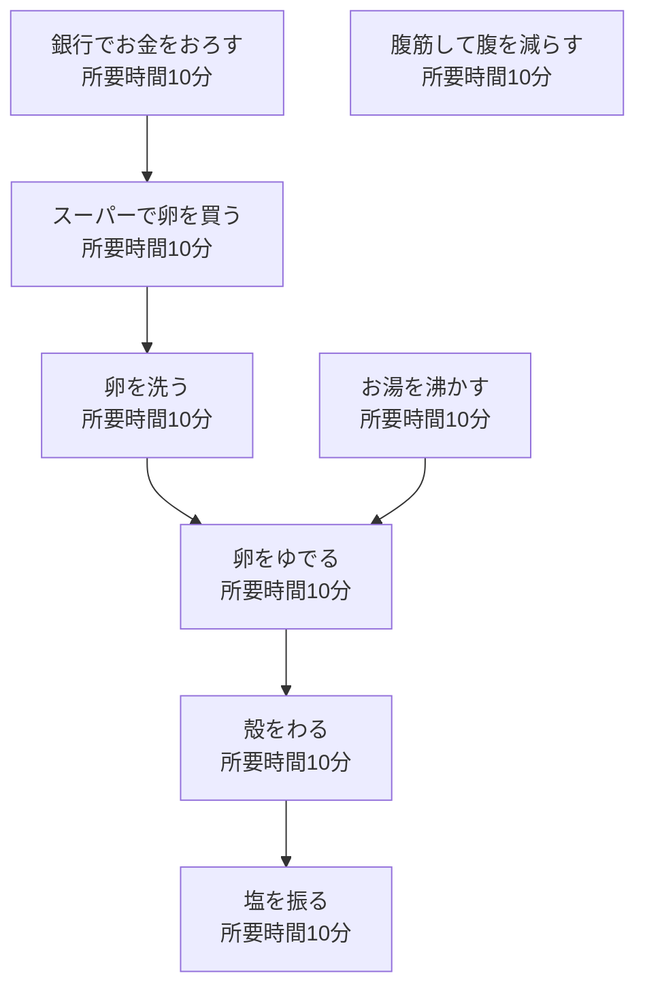

```mermaid

flowchart TD

id1["銀行でお金をおろす
所要時間10分"]

id2["スーパーで卵を買う
所要時間10分"]

id3["卵を洗う
所要時間10分"];

id4["お湯を沸かす
所要時間10分"]

id5["卵をゆでる
所要時間10分"]

id6["殻をわる
所要時間10分"]

id7["塩を振る
所要時間10分"]

id8["腹筋して腹を減らす
所要時間10分"]

id1-->id2;
id2-->id3;
id3-->id5;

id4-->id5;
id5-->id6;
id6-->id7;

id8;

```